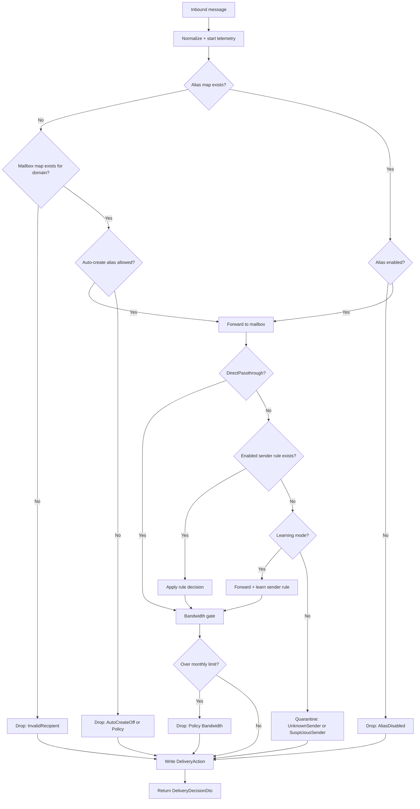

This page explains what happens inside `ProcessEmailCommandHandler` when Nullbox receives an inbound email.

Source: `src/2 - Fabric/Nullbox.Fabric/Nullbox.Fabric.Application/Deliveries/ProcessEmail/ProcessEmailCommandHandler.cs`

## The 10-second overview

For every inbound message, the handler:

1. Normalizes inputs and starts telemetry (tracing + metrics).
2. Resolves the recipient to an existing alias or a mailbox domain.
3. Decides `Forward`, `Drop`, or `Quarantine`.
4. Writes a `DeliveryAction` record describing what happened.
5. Returns a `DeliveryDecisionDto` (action + forward addresses).

## What goes in (command input)

The handler receives a `ProcessEmailCommand` with fields like:

- `Alias`, `Domain`, `RoutingKey` (used to identify the recipient and build a forwarding identity)
- `Sender`, `SenderDomain`, `Recipient`, `RecipientDomain`
- `Subject`, `SubjectHash`, `HasAttachments`, `AttachmentsCount`, `Size`
- `ReceivedAtUtc` and `Source` (defaults to `cloudflare-email-routing` if blank)

Before doing anything else, the handler trims/lowercases the parts it uses for lookups and logging.

## Main decision flow

## Step-by-step (with the important details)

### 1) Resolve the recipient

The handler builds a “fully qualified alias” like:

`{aliasLocal}@{domain}`

Then it tries:

- `IAliasMapRepository.FindByIdAsync(fullyQualifiedAlias)`
- If not found, `IMailboxMapRepository.FindByIdAsync(domain)`

Outcomes:

- Alias map missing + mailbox map missing → `Drop` with `DropReason.InvalidRecipient`
- Mailbox map exists but alias missing → try auto-create (next section)
- Alias map exists:
  - `IsEnabled == true` → `Forward` to `aliasMap.EmailAddress`
  - `IsEnabled == false` → `Drop` with `DropReason.AliasDisabled`

### 2) Auto-create an alias (only when mailbox domain is known)

If the mailbox domain is valid but the alias doesn’t exist yet, the handler can create one on the fly:

- Creates a new `Alias` entity and sets `forwardTo = mailbox.EmailAddress`
- Treats the alias as “learning mode” for this first delivery (see sender rules below)

Auto-create is allowed only when all of these are true:

- `mailbox.AutoCreateAlias` is enabled
- Alias-count policy passes:
  - Current count comes from `TrafficStatistic.Aliases` on the mailbox “all time” bucket
  - Maximum comes from `EffectiveEnablement.MaxAliasesPerMailbox` (null means unlimited)
- Bandwidth policy passes:
  - Current month comes from `TrafficStatistic.Bandwidth` on the account month bucket
  - Maximum comes from `EffectiveEnablement.MaxBandwidthBytesPerPeriod` (null means unlimited)

If auto-create is not allowed, the handler drops with:

- `DropReason.AutoCreateOff` (auto-create disabled), or
- `DropReason.Policy` (limits reached)

### 3) Compute `forwardFrom`

If the message is still going to be forwarded, the handler builds a “forward-from” identity:

`{aliasLocal}+{routingKey}@{domain with routingKey replaced by "mg"}`

This is the address the downstream mail sender can use to preserve alias + routing context.

### 4) Apply sender rules (DirectPassthrough + LearningMode)

If we’re forwarding and we have a real `aliasId`, the handler applies sender controls:

- `DirectPassthrough`:
  - If `true`, the message stays forwarded (no sender filtering)
  - The sender is still tracked, and a default allow rule may be created for UI visibility
- Otherwise, it looks for an exact-email `AliasRule` for this sender:
  - Rule id is deterministic: `r:{senderEmailNormalized}`
  - If a rule exists and is enabled, its `DeliveryDecision` is applied:
    - `Forward` → forward
    - `Drop` → drop (reason `Policy`)
    - `Quarantine` → quarantine (reason `Policy`)

If there is no enabled rule:

- If `LearningMode` is on (or the alias was auto-created in this request):
  - Default decision is `Forward`
  - A learned rule is written for that sender (`AliasRuleSource.Learned`)
- If `LearningMode` is off:
  - Default decision is `Quarantine`
  - Reason is `UnknownSender`, unless the sender looks suspicious:
    - Punycode domains (`xn--...`) or non‑ASCII characters → `SuspiciousSender`

If a message ends up `Drop`/`Quarantine` at this stage, the handler clears `forwardTo` and `forwardFrom`.

### 5) Enforce the bandwidth gate (even for existing aliases)

As a final check, *any* message that is about to be forwarded is re-checked against monthly account bandwidth.

If the projected total exceeds the effective limit:

- Action becomes `Drop`
- Reason becomes `DropReason.Policy`
- `forwardTo`/`forwardFrom` are cleared

### 6) Always write a `DeliveryAction`

After the final decision, the handler writes a `DeliveryAction` record with the message metadata and outcome.

It also chooses a partition key that makes the data easy to query by time:

- Alias known: `a:{aliasId}:t:{yyyyMMddHH}`
- Else mailbox known: `m:{mailboxId}:t:{yyyyMMddHH}`
- Else: `d:{domain}:t:{yyyyMMddHH}`

## What gets written (side effects)

Depending on the path taken, the handler may write:

- `Alias` (auto-created alias)
- `AliasRule` (learned sender rule)
- `AliasSender` (sender tracking + last decision)
- `DeliveryAction` (always)

## Observability (logs + metrics)

The handler emits:

- Trace span: `ActivitySource = "Nullbox.Fabric.ProcessEmail"`, activity name `"ProcessEmail"`
- Metrics:
  - `email.messages.total`
  - `email.messages.forwarded`
  - `email.messages.dropped`
  - `email.messages.quarantined`
  - `email.processing.duration` (ms)
- Logs:
  - `Information` for forwards
  - `Warning` for drops/quarantines
  - `Error` for unhandled exceptions

